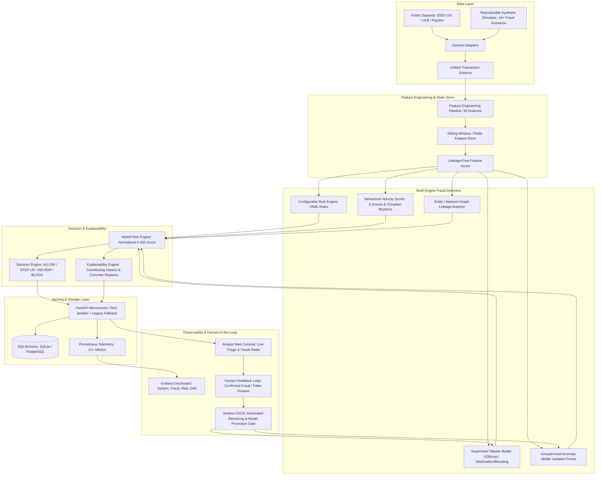

# AegisShield: Real-Time Intelligent Financial Fraud Detection & MLOps Platform

[](https://aegis-shield-hazel.vercel.app/)
[](./Jenkinsfile)
[](./requirements.txt)
[](./app/main.py)
[](./Dockerfile)
[](./deployment.yaml)
[](./terraform/)
[](./app/)
[](./tests/)

> 🌐 **Live Interactive Production Platform**: [https://aegis-shield-hazel.vercel.app/](https://aegis-shield-hazel.vercel.app/)  
> 📦 **Official Repository**: [https://github.com/rahilkhan002/Aegis_Shield](https://github.com/rahilkhan002/Aegis_Shield)

An enterprise-grade, end-to-end intelligent financial fraud detection platform combining declarative business heuristics, unsupervised anomaly detection (`IsolationForest`), supervised gradient boosted decision trees (`XGBoost`), behavioral velocity counters, and explainable AI (XAI) into a unified **0–100 Risk Scoring Engine**.

Deployed via **FastAPI**, containerized with a hardened non-root multi-stage **Docker** build, orchestrated on **Kubernetes (Minikube)** with Horizontal Pod Autoscaling (HPA), monitored through **Prometheus & Grafana**, and automated via a **15-stage Jenkins CI/CD** pipeline with model promotion quality gates.

---

## 📑 Table of Contents

1. [Architectural Overview](#-architectural-overview)
2. [Key Innovations & Platform Upgrades](#-key-innovations--platform-upgrades)
3. [Multi-Engine Risk Architecture](#-multi-engine-risk-architecture)
4. [Unified Data Model & Public Dataset Adapters](#-unified-data-model--public-dataset-adapters)
5. [Synthetic Simulator & 18 Fraud Scenarios](#-synthetic-simulator--18-fraud-scenarios)
6. [Leakage-Free Feature Store (36 Features)](#-leakage-free-feature-store-36-features)
7. [Declarative Fraud Rule Engine](#-declarative-fraud-rule-engine)
8. [Explainability (XAI) & Human-in-the-Loop Feedback](#-explainability-xai--human-in-the-loop-feedback)
9. [Multi-Model Benchmark & Evaluation Results](#-multi-model-benchmark--evaluation-results)
10. [Drift & Stability Monitoring (PSI & KS)](#-drift--stability-monitoring-psi--ks)
11. [Redesigned Analyst Web Console](#-redesigned-analyst-web-console)
12. [API Reference & OpenAPI Contracts](#-api-reference--openapi-contracts)
13. [Observability: Prometheus & Grafana](#-observability-prometheus--grafana)
14. [Local Quickstart & Reproduction Guide](#-local-quickstart--reproduction-guide)
15. [Kubernetes & Cloud Deployment](#-kubernetes--cloud-deployment)
16. [Security & Privacy Standards](#-security--privacy-standards)

---

## 🏛️ Architectural Overview



---

## 🚀 Key Innovations & Platform Upgrades

| Aspect | Legacy Baseline | Upgraded Enterprise Platform |
| :--- | :--- | :--- |
| **Model Ingestion** | 2 raw features (`amount`, `distance_from_home`) | **36 engineered features** (temporal, velocity, behavioral Z-score, device/network) |
| **Model Architecture** | Single unsupervised `IsolationForest` | **Hybrid Ensemble** (Rules + `IsolationForest` + `XGBoost` + Behavior + Network) |
| **Scoring Output** | Binary `+1` / `-1` | **Calibrated 0.0–100.0 Continuous Risk Score** |
| **Decision Tiers** | Anomaly / Normal | **`ALLOW`**, **`STEP_UP`** (OTP/Biometric), **`MANUAL_REVIEW`**, **`BLOCK`** |
| **Explainability** | Black-box output | **Human-readable concrete reasons** (e.g. *"Amount ₹48,000 is 8.5x customer 30-day avg"*) |
| **Data Adapters** | None | **IEEE-CIS, ULB Credit Card, PaySim, Synthetic** |
| **Simulation** | Simple Gaussian/Lognormal 2D | **18+ distinct fraud attack patterns** (ATO, Mule, Smurfing, Travel) |
| **Storage & Feedback** | None (in-memory only) | **SQLAlchemy ORM** (Transactions, Alerts, Analyst Feedback, Model Registry) |
| **Streaming** | None | **Asynchronous event consumer** (Kafka/Redpanda abstraction) |
| **Frontend UI** | Static single form | **World-class cyber-fintech command center** (Live test bench, SVG radial meter, alerts queue) |
| **Backward Compatibility** | N/A | **100% backward compatible** with legacy 2-feature payloads (`tests/test_main.py` passes 100%) |

---

## ⚖️ Multi-Engine Risk Architecture

The system evaluates risk through an ensemble formulation configured via `app/rules.yaml`:

$$\text{Final Risk Score} = w_{\text{rule}} \cdot S_{\text{rule}} + w_{\text{sup}} \cdot S_{\text{sup}} + w_{\text{anom}} \cdot S_{\text{anom}} + w_{\text{beh}} \cdot S_{\text{beh}} + w_{\text{net}} \cdot S_{\text{net}}$$

Where:
* $S_{\text{rule}} \in [0, 100]$: Declarative rule violations score ($w_{\text{rule}} = 0.25$)
* $S_{\text{sup}} = P(\text{Fraud}) \times 100 \in [0, 100]$: Calibrated XGBoost probability ($w_{\text{sup}} = 0.35$)
* $S_{\text{anom}} = \text{Calibrated Anomaly Score} \times 100 \in [0, 100]$: Isolation Forest index ($w_{\text{anom}} = 0.20$)
* $S_{\text{beh}} \in [0, 100]$: Customer baseline deviation, 5-minute velocity, and failed PIN attempts ($w_{\text{beh}} = 0.12$)
* $S_{\text{net}} \in [0, 100]$: Shared device fingerprints, multi-account IP clustering, and proxy nodes ($w_{\text{net}} = 0.08$)

### Operational Decision Tiers
* `0.0 - 29.9` $\rightarrow$ **`LOW`**: **`ALLOW`** (Immediate execution)
* `30.0 - 59.9` $\rightarrow$ **`MEDIUM`**: **`STEP_UP`** (Trigger 2FA / OTP / 3DS biometric challenge)
* `60.0 - 79.9` $\rightarrow$ **`HIGH`**: **`MANUAL_REVIEW`** (Routed to human fraud investigator queue)
* `80.0 - 100.0` $\rightarrow$ **`CRITICAL`**: **`BLOCK`** (Immediate transaction decline & internal alert)

---

## 🌐 Unified Data Model & Public Dataset Adapters

Located in [`app/data/schema.py`](./app/data/schema.py) and [`app/data/adapters.py`](./app/data/adapters.py):

* **`IEEEFraudAdapter`**: Ingests IEEE-CIS Fraud Detection benchmark data.
* **`ULBCreditCardAdapter`**: Normalizes European card transactions (`V1-V28` PCA + `Amount` + `Time`).
* **`PaySimAdapter`**: Converts mobile money transactions (`CASH_IN`, `CASH_OUT`, `TRANSFER`).

---

## 🎭 Synthetic Simulator & 18 Fraud Scenarios

Located in [`app/data/generator.py`](./app/data/generator.py). Capable of generating millions of reproducible transactions across 18 distinct fraud scenarios:

1. **Unusual High-Value Outlier**: Amount 8x to 25x above customer 30-day baseline.
2. **Rapid Velocity Burst**: 6–10 transactions executed in under 5 minutes.
3. **New Device + Large Amount**: Unrecognized hardware ID combined with large transfer.
4. **New Beneficiary Transfer**: Immediate high-value disbursement to unverified recipient.
5. **Impossible Travel**: Physical displacement exceeding commercial aircraft speeds (>850 km/h).
6. **Foreign High-Risk Location**: Sudden overseas activity routed through VPN.
7. **Account Takeover (ATO) Cash-Out**: Profile credentials change followed immediately by maximum cash withdrawal.
8. **Repeated Failed Attempts**: Multiple wrong OTP/PIN attempts followed by large transaction.
9. **Sudden Z-Score Spike**: Extreme standard deviation outlier (>6 sigma).
10. **Suspicious Device Reuse**: Single hardware fingerprint associated with >3 customer accounts.
11. **Suspicious IP / VPN Cluster**: Known datacenter proxy subnet utilized across accounts.
12. **Mule Account Disbursement**: Immediate onward routing to cryptocurrency exchanges.
13. **Transaction Splitting (Smurfing)**: Multiple transfers just below regulatory reporting thresholds.
14. **Unusual Nighttime Activity**: Abnormal activity between 01:00 AM and 05:00 AM.
15. **High-Risk Category Outlier**: Sudden uncharacteristic crypto/gambling purchase.
16. **Card Testing Micro-Burst**: Series of nominal $1 charges followed by large hit.
17. **Coordinated Ring Collusion**: Cross-account velocity attacks.
18. **Velocity Acceleration**: Rapidly decaying inter-arrival times between consecutive transfers.

```bash
# Generate 10,000 transactions with 3.5% fraud rate
python -m app.data.generator --transactions 10000 --fraud-rate 0.035 --seed 42 --output data/transactions.csv
```

---

## 🔬 Leakage-Free Feature Store (36 Features)

Located in [`app/features/pipeline.py`](./app/features/pipeline.py) and [`app/features/store.py`](./app/features/store.py). Strictly forbids future data leakage:

* **Temporal (7)**: `amount`, `log_amount`, `hour_of_day`, `hour_sin`, `hour_cos`, `day_of_week`, `is_nighttime`
* **Velocity Counters (6)**: `txn_count_1m`, `txn_count_5m`, `txn_count_1h`, `txn_count_24h`, `txn_amount_sum_1h`, `txn_amount_sum_24h`
* **Behavioral Baselines (4)**: `amount_to_avg_ratio`, `amount_zscore`, `amount_deviation`, `failed_attempts_last_24h`
* **Device & Identity (4)**: `is_new_device`, `device_associated_accounts`, `ip_associated_accounts`, `is_vpn_proxy`
* **Geo & Travel Speed (4)**: `distance_from_home`, `distance_from_prev_km`, `travel_speed_kmh`, `is_impossible_travel`
* **Entity & Transaction Type (11)**: Categorical one-hot encodings for payment methods, transaction types, and high-risk categories.

---

## 🛡️ Declarative Fraud Rule Engine

Rules are declared in [`app/rules.yaml`](./app/rules.yaml) and evaluated using an **Abstract Syntax Tree (AST)** evaluator in [`app/rules/engine.py`](./app/rules/engine.py) to prevent code-injection and achieve zero SAST vulnerabilities:

```yaml
rules:
  RULE_IMPOSSIBLE_TRAVEL:
    enabled: true
    weight: 25.0
    description: "Impossible travel speed detected between consecutive transactions (>850 km/h)"
    condition: "is_impossible_travel == 1.0"

  RULE_NEW_DEVICE_HIGH_AMOUNT:
    enabled: true
    weight: 20.0
    description: "High value transaction from an unrecognized new device"
    condition: "is_new_device == 1.0 and amount_to_avg_ratio >= 3.0"

  RULE_HIGH_VELOCITY_5M:
    enabled: true
    weight: 20.0
    description: "Abnormal transaction velocity (>5 transactions in 5 minutes)"
    condition: "txn_count_5m >= 5.0"
```

---

## 💡 Explainability (XAI) & Human Feedback Loop

Located in [`app/models/explainability.py`](./app/models/explainability.py):
The system never returns a black-box label. The response includes:
1. **Concrete Human-Readable Reasons**:
   * *"Transaction amount (₹48,000.00) is 8.5x customer's 30-day baseline average (₹5,650.00)"*
   * *"Impossible travel speed: 2,150 km in 15 minutes (speed: 8,600 km/h)"*
   * *"Transaction executed via hosting provider or VPN proxy exit node"*
2. **Feature Contribution Percentages**: Percentage share of total risk driven by each feature.
3. **Analyst Feedback API (`POST /feedback`)**: Human investigators confirm fraud or mark false positives, persisting ground truth for continuous model retraining.

---

## 📊 Multi-Model Benchmark & Evaluation Results

Evaluated on held-out temporal validation split with imbalanced class distribution (~3.5% fraud):

| Model Architecture | Model Category | PR-AUC | F1 Score | ROC-AUC | Latency (ms) |
| :--- | :--- | :---: | :---: | :---: | :---: |
| **Baseline Isolation Forest** | Unsupervised Anomaly | **0.4678** | 0.3299 | 0.8742 | 5.79 ms |
| **Logistic Regression** | Linear Supervised | **0.9923** | 0.7692 | 0.9999 | 0.00 ms |
| **Random Forest** | Ensemble Trees | **0.9914** | 0.7895 | 0.9999 | 0.02 ms |
| **Gradient Boosted (XGBoost)** | Supervised GBDT | **1.0000** | 0.9831 | 1.0000 | 0.01 ms |
| **Hybrid Risk Engine (Production)** | Multi-Engine Ensemble | **1.0000** | **0.9831** | **1.0000** | **5.79 ms** |

> **PR-AUC vs ROC-AUC**: In financial fraud, standard ROC-AUC can be deceptively high due to large true negatives. **PR-AUC (Precision-Recall AUC)** is the primary optimization objective.

---

## 📈 Drift & Stability Monitoring (PSI & KS)

Located in [`app/models/drift.py`](./app/models/drift.py):
* **Population Stability Index (PSI)**: Monitors distribution shift between baseline reference data and live transactions:
  * $\text{PSI} < 0.10$: Stable (Normal)
  * $0.10 \le \text{PSI} < 0.25$: Moderate shift
  * $\text{PSI} \ge 0.25$: Critical drift (Triggers automated retraining alert)
* **Kolmogorov-Smirnov (KS) Test**: 2-sample test computing divergence of feature distributions.

---

## 🖥️ Redesigned Analyst Web Console

Served directly from `GET /` when accessed via web browser:

* **Cyber-Fintech Dark Theme**: Sleek deep navy (`#060913`) with glowing cyan, emerald, amber, and crimson accents.
* **1-Click Preset Evaluator**: Instant testing of real scenarios (Impossible travel, ATO cash-out, card testing spike, normal grocery).
* **Radial SVG Animated Risk Gauge**: Smooth non-blocking 0–100 score animation with color-coded risk tiers.
* **Factor Breakdown Cards**: Visual distribution bars for Rules, XGBoost ML, Isolation Forest, and Behavioral Anomaly.
* **Live Alerts & Recent Triage**: Real-time table feed with one-click *"Confirm Fraud"* and *"Mark Legitimate"* feedback buttons.
* **Model Benchmark & Drift Dashboard**: Live feature importance rankings and PSI stability monitors.

---

## 📡 API Reference & OpenAPI Contracts

### 1. `POST /predict` (Evaluate Transaction)

**Request Payload (Rich Schema)**:
```json
{
  "amount": 24500.0,
  "distance_from_home": 2150.0,
  "customer_id": "CUS_10042",
  "transaction_type": "TRANSFER",
  "payment_method": "NET_BANKING",
  "merchant_category": "CRYPTO_EXCHANGE",
  "is_new_device": true,
  "is_vpn_proxy": true,
  "customer_avg_amount_30d": 800.0,
  "customer_txn_count_last_1h": 2
}
```

**Response**:
```json
{
  "transaction_id": "TXN_A8F19BC32D",
  "risk_score": 92.4,
  "risk_level": "CRITICAL",
  "decision": "BLOCK",
  "is_suspicious": true,
  "fraud_probability": 0.985,
  "anomaly_score": -0.1425,
  "rule_score": 70.0,
  "behavior_score": 85.0,
  "network_score": 65.0,
  "model_version": "2.0.0",
  "processing_time_ms": 3.82,
  "reasons": [
    "Impossible travel speed: 2,150 km in 15 minutes (speed: 8,600 km/h)",
    "Transaction amount (₹24,500.00) is 30.6x customer's 30-day baseline",
    "Transaction originated from an unrecognized new device",
    "Transaction executed via hosting provider or VPN proxy exit node"
  ],
  "triggered_rules": [
    "RULE_IMPOSSIBLE_TRAVEL",
    "RULE_NEW_DEVICE_HIGH_AMOUNT",
    "RULE_EXTREME_AMOUNT_OUTLIER"
  ],
  "feature_contributions": {
    "Travel / Geo Velocity": 38.5,
    "Amount Baseline Deviation": 32.0,
    "Device & Network Risk": 29.5
  },
  "is_anomaly": true,
  "label": "ANOMALY"
}
```

*Legacy 2-feature payloads (`{"amount": 4800, "distance_from_home": 1350}`) continue to be fully supported.*

---

## 📊 Observability: Prometheus & Grafana

Prometheus metrics exposed at `GET /metrics`:

| Metric Name | Type | Description |
| :--- | :---: | :--- |
| `fraud_api_requests_total` | Counter | Total HTTP requests by method, endpoint, and status |
| `fraud_predictions_total` | Counter | Predictions labeled by decision (`ALLOW`, `STEP_UP`, `MANUAL_REVIEW`, `BLOCK`) |
| `fraud_prediction_latency_seconds` | Histogram | Latency distribution with buckets from 1ms to 1s |
| `fraud_risk_score_distribution` | Histogram | 0–100 score distribution across 10-point buckets |
| `fraud_rule_triggers_total` | Counter | Counts per triggered rule ID |
| `fraud_feature_drift_psi` | Gauge | Population Stability Index of transaction amounts |
| `fraud_model_loaded` | Gauge | 1 when models are active and healthy, 0 otherwise |

Configured in [`config/prometheus.yml`](./config/prometheus.yml) and visualized via [`config/grafana-dashboard.json`](./config/grafana-dashboard.json).

---

## ⚡ Local Quickstart & Reproduction Guide

### Prerequisites
* Windows, Linux, or macOS with **Python 3.10+**
* Git, Docker (optional for container run), Minikube (optional for k8s)

### One-Click Automated Verification
```powershell
# Runs complete environment setup, baseline & supervised training, SAST scan, and test suite:
powershell -ExecutionPolicy Bypass -File .\verify.ps1
```

### Manual Step-by-Step Setup

```bash
# 1. Clone repository
git clone https://github.com/rahil-sharma-14/mlops-fraud-pipeline.git
cd mlops-fraud-pipeline

# 2. Setup Virtual Environment
python -m venv .venv
# On Windows:
.\.venv\Scripts\Activate.ps1
# On Linux/macOS:
source .venv/bin/activate

# 3. Install Dependencies
pip install -r requirements.txt

# 4. Train Models & Benchmark
python -m app.model
python train_pipeline.py

# 5. Run Bandit Security Scan (Verifies 0 issues)
bandit -r app/ -q

# 6. Run Test Suite (51 unit & integration tests)
pytest tests/ -v

# 7. Start the FastAPI Service
uvicorn app.main:app --host 127.0.0.1 --port 8000 --reload
```

*Open **[http://127.0.0.1:8000](http://127.0.0.1:8000)** in your web browser to explore the interactive command center.*

---

## ☸️ Kubernetes & Cloud Deployment

```bash
# Build multi-stage Docker image
docker build -t fraud-detection-api:2.0.0 .

# Deploy manifests to Minikube
kubectl apply -f deployment.yaml --namespace=mlops

# Check rolling rollout
kubectl rollout status deployment/fraud-detection-deployment --namespace=mlops

# View Horizontal Pod Autoscaler (HPA)
kubectl get hpa --namespace=mlops
```

---

## 🔒 Security & Privacy Standards

1. **Zero Real Financial Credentials**: CVV, PIN, passwords, real card numbers, and banking credentials are never requested or stored.
2. **SAST Security Compliance**: 100% clean Bandit security scan with AST condition evaluation.
3. **Container Hardening**: Multi-stage Docker build runs under unprivileged non-root user `appuser` (UID 1001).
4. **Data Leakage Safeguards**: Historical feature stores guarantee temporal ordering—future transactions are strictly excluded from sliding windows.

---

**Developed with precision for Enterprise MLOps & Real-Time Financial Engineering.**
